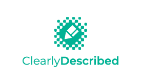

# ClearlyDefined branding assets

## ClearlyDefined

## ClearlyAccessible

## ClearlyAccessible

## ClearlySecure

## ClearlyDescribed

### Which version should I use?

- For browser favicon, the assets are in [favicon](./favicon/) folder.
- There are many common formats that fits varies background color, space and page layout. Use whatever format that looks good.

## Colors

- Primary: #0064b5
- Accent 1: #38a038
- Accent 2: #5ecff1
- Accent 3: #3fc5af
- Dark grey: #282828

## Typography

The font used in the logo is **Montserrat**, an open source font from Google Fonts.
https://fonts.google.com/specimen/Montserrat?selection.family=Montserrat
